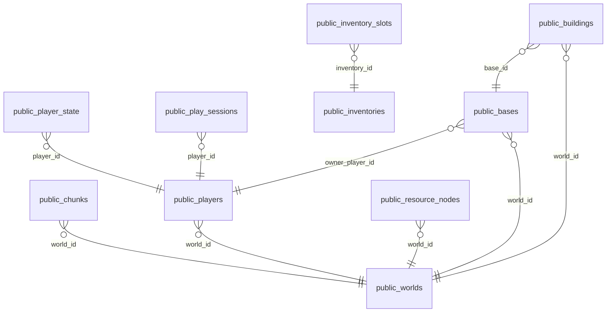

# beaver (сервер 78, postgres)

Проект: Beaver. Размер: 8.4 МБ.

## Связи

## public.bases — 2 строк

| Поле | Тип | Обязательное | Ключ |
|---|---|---|---|
| id | bigint | да |  |
| owner_player_id | bigint | да |  |
| world_id | bigint | да |  |
| pos_x | double precision | да |  |
| pos_y | double precision | да |  |
| pos_z | double precision | да |  |
| radius | double precision | да |  |
| level | integer | да |  |
| created_at | timestamp with time zone | да |  |

## public.beaver_migrations — 3 строк

| Поле | Тип | Обязательное | Ключ |
|---|---|---|---|
| name | text | да |  |
| applied_at | timestamp with time zone | да |  |

## public.buildings — 9 строк

| Поле | Тип | Обязательное | Ключ |
|---|---|---|---|
| id | bigint | да |  |
| base_id | bigint | да |  |
| world_id | bigint | да |  |
| building_def | text | да |  |
| level | integer | да |  |
| pos_x | double precision | да |  |
| pos_y | double precision | да |  |
| pos_z | double precision | да |  |
| rotation | double precision | да |  |
| hp | integer | да |  |
| state | text | да |  |
| meta | jsonb |  |  |
| built_at | timestamp with time zone | да |  |
| grid_x | integer |  |  |
| grid_y | integer | да |  |
| grid_z | integer |  |  |
| slot | text |  |  |

## public.chunks — 5 строк

| Поле | Тип | Обязательное | Ключ |
|---|---|---|---|
| world_id | bigint | да |  |
| cx | integer | да |  |
| cz | integer | да |  |
| biome | text |  |  |
| generated_at | timestamp with time zone | да |  |

## public.game_log — 103 строк

| Поле | Тип | Обязательное | Ключ |
|---|---|---|---|
| id | bigint | да |  |
| kind | text | да |  |
| player_id | bigint |  |  |
| data | jsonb |  |  |
| created_at | timestamp with time zone | да |  |

## public.inventories — 4 строк

| Поле | Тип | Обязательное | Ключ |
|---|---|---|---|
| id | bigint | да |  |
| owner_kind | text | да |  |
| owner_id | bigint | да |  |
| capacity | integer | да |  |
| created_at | timestamp with time zone | да |  |

## public.inventory_slots — 3 строк

| Поле | Тип | Обязательное | Ключ |
|---|---|---|---|
| inventory_id | bigint | да |  |
| slot | integer | да |  |
| item_def | text | да |  |
| qty | integer | да |  |
| meta | jsonb |  |  |

## public.play_sessions — 45 строк

| Поле | Тип | Обязательное | Ключ |
|---|---|---|---|
| id | bigint | да |  |
| player_id | bigint | да |  |
| token_hash | text | да |  |
| created_at | timestamp with time zone | да |  |
| expires_at | timestamp with time zone | да |  |
| revoked_at | timestamp with time zone |  |  |

## public.player_state — 2 строк

| Поле | Тип | Обязательное | Ключ |
|---|---|---|---|
| player_id | bigint | да |  |
| pos_x | double precision | да |  |
| pos_y | double precision | да |  |
| pos_z | double precision | да |  |
| yaw | double precision | да |  |
| health | integer | да |  |
| save_version | integer | да |  |
| updated_at | timestamp with time zone | да |  |

## public.players — 2 строк

| Поле | Тип | Обязательное | Ключ |
|---|---|---|---|
| id | bigint | да |  |
| tg_user_id | bigint | да |  |
| account_id | bigint |  |  |
| display_name | text | да |  |
| world_id | bigint | да |  |
| level | integer | да |  |
| experience | integer | да |  |
| created_at | timestamp with time zone | да |  |
| last_seen_at | timestamp with time zone | да |  |

## public.resource_nodes — 12 строк

| Поле | Тип | Обязательное | Ключ |
|---|---|---|---|
| id | text | да |  |
| world_id | bigint | да |  |
| cx | integer | да |  |
| cz | integer | да |  |
| resource_def | text | да |  |
| pos_x | double precision | да |  |
| pos_y | double precision | да |  |
| pos_z | double precision | да |  |
| amount | integer | да |  |
| max_amount | integer | да |  |
| state | text | да |  |
| respawn_at | timestamp with time zone |  |  |
| updated_at | timestamp with time zone | да |  |

## public.worlds — 1 строк

| Поле | Тип | Обязательное | Ключ |
|---|---|---|---|
| id | bigint | да |  |
| name | text | да |  |
| seed | bigint | да |  |
| status | text | да |  |
| map_version | integer | да |  |
| spawn_x | double precision | да |  |
| spawn_y | double precision | да |  |
| spawn_z | double precision | да |  |
| created_at | timestamp with time zone | да |  |
