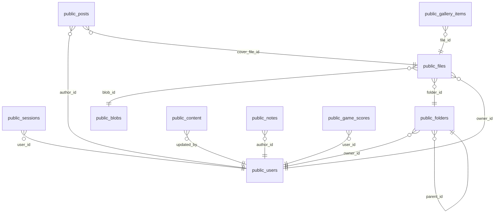

# eeklera (сервер 78, postgres)

Проект: EEKLERA — сервисы. Размер: 8.4 МБ.

## Связи

## public.blobs — 1 строк

| Поле | Тип | Обязательное | Ключ |
|---|---|---|---|
| id | bigint | да |  |
| sha256 | text | да |  |
| byte_size | bigint | да |  |
| mime | text | да |  |
| rel_path | text | да |  |
| width | integer |  |  |
| height | integer |  |  |
| created_at | timestamp with time zone | да |  |

## public.content — 22 строк

| Поле | Тип | Обязательное | Ключ |
|---|---|---|---|
| id | bigint | да |  |
| key | text | да |  |
| value | jsonb | да |  |
| source | text | да |  |
| updated_by | bigint |  |  |
| created_at | timestamp with time zone | да |  |
| updated_at | timestamp with time zone | да |  |

## public.files — 1 строк

| Поле | Тип | Обязательное | Ключ |
|---|---|---|---|
| id | bigint | да |  |
| blob_id | bigint | да |  |
| folder_id | bigint |  |  |
| owner_id | bigint |  |  |
| name | text | да |  |
| visibility | text | да |  |
| meta | jsonb | да |  |
| created_at | timestamp with time zone | да |  |
| updated_at | timestamp with time zone | да |  |

## public.folders — 3 строк

| Поле | Тип | Обязательное | Ключ |
|---|---|---|---|
| id | bigint | да |  |
| owner_id | bigint |  |  |
| parent_id | bigint |  |  |
| name | text | да |  |
| kind | text | да |  |
| created_at | timestamp with time zone | да |  |
| updated_at | timestamp with time zone | да |  |

## public.gallery_items — 1 строк

| Поле | Тип | Обязательное | Ключ |
|---|---|---|---|
| id | bigint | да |  |
| file_id | bigint | да |  |
| title | text | да |  |
| tag | text | да |  |
| position | integer | да |  |
| visibility | text | да |  |
| created_at | timestamp with time zone | да |  |
| updated_at | timestamp with time zone | да |  |

## public.game_scores — 1 строк

| Поле | Тип | Обязательное | Ключ |
|---|---|---|---|
| id | bigint | да |  |
| game | text | да |  |
| user_id | bigint |  |  |
| alias | text | да |  |
| score | integer | да |  |
| duration_s | integer |  |  |
| details | jsonb | да |  |
| created_at | timestamp with time zone | да |  |

## public.notes — 3 строк

| Поле | Тип | Обязательное | Ключ |
|---|---|---|---|
| id | bigint | да |  |
| author_id | bigint | да |  |
| title | text | да |  |
| body | text | да |  |
| status | text | да |  |
| visibility | text | да |  |
| publish_count | integer | да |  |
| published_at | timestamp with time zone |  |  |
| created_at | timestamp with time zone | да |  |
| updated_at | timestamp with time zone | да |  |

## public.posts — 0 строк

| Поле | Тип | Обязательное | Ключ |
|---|---|---|---|
| id | bigint | да |  |
| author_id | bigint | да |  |
| slug | text | да |  |
| title | text | да |  |
| excerpt | text | да |  |
| body | text | да |  |
| cover_file_id | bigint |  |  |
| status | text | да |  |
| published_at | timestamp with time zone |  |  |
| created_at | timestamp with time zone | да |  |
| updated_at | timestamp with time zone | да |  |

## public.schema_migrations — 5 строк

| Поле | Тип | Обязательное | Ключ |
|---|---|---|---|
| name | text | да |  |
| applied_at | timestamp with time zone | да |  |

## public.sessions — 4 строк

| Поле | Тип | Обязательное | Ключ |
|---|---|---|---|
| id | bigint | да |  |
| user_id | bigint | да |  |
| token_hash | text | да |  |
| user_agent | text | да |  |
| ip | inet |  |  |
| created_at | timestamp with time zone | да |  |
| last_seen_at | timestamp with time zone | да |  |
| expires_at | timestamp with time zone | да |  |

## public.users — 1 строк

| Поле | Тип | Обязательное | Ключ |
|---|---|---|---|
| id | bigint | да |  |
| email | text | да |  |
| email_lower | text | да |  |
| name | text | да |  |
| password_hash | text | да |  |
| role | text | да |  |
| status | text | да |  |
| created_at | timestamp with time zone | да |  |
| updated_at | timestamp with time zone | да |  |
