# sentra_test (сервер 78, postgres)

Проект: —. Размер: 39.0 МБ.

## Связи

```mermaid
erDiagram
  public_account_scopes }o--|| public_accounts : "account_id"
  public_achievement_awards }o--|| public_accounts : "awarded_by"
  public_achievement_awards }o--|| public_chats : "chat_id"
  public_achievement_awards }o--|| public_achievement_defs : "def_id"
  public_achievement_defs }o--|| public_chats : "chat_id"
  public_achievements_awarded }o--|| public_chats : "chat_id"
  public_ai_reviews }o--|| public_chats : "chat_id"
  public_audit_log }o--|| public_accounts : "account_id"
  public_banned_words }o--|| public_chats : "chat_id"
  public_bot_api_keys }o--|| public_bots : "bot_id"
  public_bots }o--|| public_accounts : "owner_account_id"
  public_business_liquidity_pools }o--|| public_economy_businesses : "business_id"
  public_business_liquidity_pools }o--|| public_economy_players : "owner_tg_user_id"
  public_chat_members }o--|| public_chats : "chat_id"
  public_chat_members }o--|| public_tg_users : "tg_user_id"
  public_chats }o--|| public_bots : "bot_id"
  public_community_settings }o--|| public_chats : "chat_id"
  public_custom_commands }o--|| public_chats : "chat_id"
  public_dashboard_access }o--|| public_accounts : "account_id"
  public_dashboard_access }o--|| public_chats : "chat_id"
  public_dashboard_access }o--|| public_accounts : "granted_by"
  public_economy_businesses }o--|| public_economy_business_catalog : "catalog_id"
  public_economy_businesses }o--|| public_economy_companies : "company_id"
  public_economy_businesses }o--|| public_economy_players : "owner_tg_user_id"
  public_economy_company_members }o--|| public_economy_companies : "company_id"
  public_economy_company_transactions }o--|| public_economy_companies : "company_id"
  public_economy_dividends }o--|| public_economy_companies : "company_id"
  public_economy_dividends }o--|| public_economy_securities : "security_id"
  public_economy_employment }o--|| public_economy_job_catalog : "job_id"
  public_economy_employment }o--|| public_economy_players : "tg_user_id"
  public_economy_inventory }o--|| public_economy_item_catalog : "item_id"
  public_economy_pets }o--|| public_economy_pet_catalog : "catalog_id"
  public_economy_pets }o--|| public_economy_players : "owner_tg_user_id"
  public_economy_properties }o--|| public_economy_property_catalog : "catalog_id"
  public_economy_properties }o--|| public_economy_players : "owner_tg_user_id"
  public_economy_securities }o--|| public_economy_companies : "company_id"
  public_economy_share_holdings }o--|| public_economy_securities : "security_id"
  public_economy_share_orders }o--|| public_economy_securities : "security_id"
  public_economy_share_trades }o--|| public_economy_securities : "security_id"
  public_economy_vehicles }o--|| public_economy_vehicle_catalog : "catalog_id"
  public_economy_vehicles }o--|| public_economy_players : "owner_tg_user_id"
  public_incident_events }o--|| public_incidents : "incident_id"
  public_incidents }o--|| public_chats : "chat_id"
  public_incidents }o--|| public_accounts : "created_by"
  public_integrations }o--|| public_chats : "chat_id"
  public_invite_codes }o--|| public_accounts : "created_by"
  public_invite_codes }o--|| public_accounts : "used_by"
  public_message_stats }o--|| public_chats : "chat_id"
  public_mod_actions }o--|| public_accounts : "actor_account_id"
  public_mod_actions }o--|| public_chats : "chat_id"
  public_sessions }o--|| public_accounts : "account_id"
  public_store_access }o--|| public_storefronts : "storefront_id"
  public_store_attach }o--|| public_store_products : "product_id"
  public_store_buyer_prefs }o--|| public_storefronts : "storefront_id"
  public_store_drop_subs }o--|| public_store_products : "product_id"
  public_store_drop_subs }o--|| public_storefronts : "storefront_id"
  public_store_grants }o--|| public_storefronts : "storefront_id"
  public_store_orders }o--|| public_store_products : "product_id"
  public_store_orders }o--|| public_storefronts : "storefront_id"
  public_store_pay_methods }o--|| public_storefronts : "storefront_id"
  public_store_products }o--|| public_storefronts : "storefront_id"
  public_store_reviews }o--|| public_store_orders : "order_id"
  public_store_reviews }o--|| public_store_products : "product_id"
  public_store_reviews }o--|| public_storefronts : "storefront_id"
  public_storefronts }o--|| public_bots : "bot_id"
  public_storefronts }o--|| public_accounts : "owner_account_id"
  public_support_conversations }o--|| public_accounts : "assigned_admin_id"
  public_support_conversations }o--|| public_store_orders : "order_id"
  public_support_conversations }o--|| public_storefronts : "storefront_id"
  public_support_message_attachments }o--|| public_support_messages : "message_id"
  public_support_messages }o--|| public_support_conversations : "conversation_id"
  public_support_messages }o--|| public_accounts : "sender_admin_id"
  public_user_messages }o--|| public_chats : "chat_id"
  public_user_notes }o--|| public_chats : "chat_id"
  public_user_points }o--|| public_chats : "chat_id"
  public_warnings }o--|| public_chats : "chat_id"
  public_webhook_deliveries }o--|| public_integrations : "integration_id"
  public_beaver_dam }o--|| public_chats : "chat_id"
  public_policy_runs }o--|| public_policies : "policy_id"
  public_notifications }o--|| public_notification_channels : "channel_id"
  public_chats }o--|| public_workspaces : "workspace_id"
  public_policies }o--|| public_workspaces : "workspace_id"
  public_river_state }o--|| public_chats : "chat_id"
  public_river_contrib }o--|| public_chats : "chat_id"
  public_river_events }o--|| public_chats : "chat_id"
  public_river_votes }o--|| public_river_events : "event_id"
  public_river_log }o--|| public_chats : "chat_id"
  public_river_runs }o--|| public_chats : "chat_id"
```

## public.account_scopes — 4838 строк

| Поле | Тип | Обязательное | Ключ |
|---|---|---|---|
| account_id | bigint | да |  |
| scope_id | text | да |  |
| role | text | да |  |
| created_at | timestamp with time zone | да |  |

## public.accounts — 10035 строк

| Поле | Тип | Обязательное | Ключ |
|---|---|---|---|
| id | bigint | да |  |
| username | text | да |  |
| password_hash | text | да |  |
| password_salt | text | да |  |
| platform_role | text | да |  |
| status | text | да |  |
| created_at | timestamp with time zone | да |  |
| last_login_at | timestamp with time zone |  |  |
| tg_user_id | bigint |  |  |

## public.achievement_awards — 0 строк

| Поле | Тип | Обязательное | Ключ |
|---|---|---|---|
| id | bigint | да |  |
| def_id | bigint | да |  |
| chat_id | bigint | да |  |
| tg_user_id | bigint | да |  |
| awarded_by | bigint |  |  |
| created_at | timestamp with time zone | да |  |

## public.achievement_defs — 0 строк

| Поле | Тип | Обязательное | Ключ |
|---|---|---|---|
| id | bigint | да |  |
| chat_id | bigint | да |  |
| title | text | да |  |
| description | text |  |  |
| emoji | text |  |  |
| created_at | timestamp with time zone | да |  |

## public.achievements_awarded — 889 строк

| Поле | Тип | Обязательное | Ключ |
|---|---|---|---|
| chat_id | bigint | да |  |
| tg_user_id | bigint | да |  |
| achievement_key | text | да |  |
| awarded_at | timestamp with time zone | да |  |

## public.ai_reviews — 982 строк

| Поле | Тип | Обязательное | Ключ |
|---|---|---|---|
| id | bigint | да |  |
| chat_id | bigint | да |  |
| model | text | да |  |
| version | text | да |  |
| confidence | real | да |  |
| category | text |  |  |
| injection_detected | boolean | да |  |
| suggested_action | text |  |  |
| text_sample | text |  |  |
| status | text | да |  |
| created_at | timestamp with time zone | да |  |

## public.audit_entries — 4180 строк

| Поле | Тип | Обязательное | Ключ |
|---|---|---|---|
| id | bigint | да |  |
| chat_id | bigint |  |  |
| actor_kind | text | да |  |
| actor_id | text |  |  |
| actor_label | text |  |  |
| action | text | да |  |
| target_kind | text |  |  |
| target_id | text |  |  |
| target_label | text |  |  |
| before_state | jsonb |  |  |
| after_state | jsonb |  |  |
| source | text | да |  |
| reason | text |  |  |
| correlation_id | text |  |  |
| ip | text |  |  |
| created_at | timestamp with time zone | да |  |

## public.audit_log — 15397 строк

| Поле | Тип | Обязательное | Ключ |
|---|---|---|---|
| id | bigint | да |  |
| account_id | bigint |  |  |
| action | text | да |  |
| detail | jsonb |  |  |
| ip | text |  |  |
| created_at | timestamp with time zone | да |  |

## public.banned_words — 334 строк

| Поле | Тип | Обязательное | Ключ |
|---|---|---|---|
| id | bigint | да |  |
| chat_id | bigint | да |  |
| word | text | да |  |
| created_at | timestamp with time zone | да |  |

## public.beaver_dam — 2 строк

| Поле | Тип | Обязательное | Ключ |
|---|---|---|---|
| chat_id | bigint | да |  |
| season | integer | да |  |
| user_id | bigint | да |  |
| logs | integer | да |  |
| golden | integer | да |  |
| last_at | timestamp with time zone | да |  |

## public.bot_api_keys — 0 строк

| Поле | Тип | Обязательное | Ключ |
|---|---|---|---|
| id | bigint | да |  |
| bot_id | bigint | да |  |
| provider | text | да |  |
| label | text |  |  |
| key_value | text | да |  |
| created_at | timestamp with time zone | да |  |

## public.bots — 4353 строк

| Поле | Тип | Обязательное | Ключ |
|---|---|---|---|
| id | bigint | да |  |
| owner_account_id | bigint | да |  |
| tg_bot_id | bigint | да |  |
| username | text |  |  |
| name | text |  |  |
| token | text | да |  |
| status | text | да |  |
| created_at | timestamp with time zone | да |  |
| ai_moderation | integer | да |  |
| ai_translation | integer | да |  |
| target_lang | text | да |  |
| poll_externally | boolean | да |  |

## public.business_liquidity_pools — 0 строк

| Поле | Тип | Обязательное | Ключ |
|---|---|---|---|
| id | bigint | да |  |
| business_id | bigint | да |  |
| owner_tg_user_id | bigint | да |  |
| coin_reserve | bigint | да |  |
| token_reserve | bigint | да |  |
| k_value | bigint | да |  |
| created_at | timestamp with time zone | да |  |

## public.capability_overrides — 0 строк

| Поле | Тип | Обязательное | Ключ |
|---|---|---|---|
| account_id | bigint | да |  |
| scope_id | text | да |  |
| capability | text | да |  |
| allowed | boolean | да |  |
| granted_by | bigint |  |  |
| reason | text |  |  |
| created_at | timestamp with time zone | да |  |

## public.chat_digests — 0 строк

| Поле | Тип | Обязательное | Ключ |
|---|---|---|---|
| chat_id | bigint | да |  |
| digest_date | date | да |  |
| text | text | да |  |
| created_at | timestamp with time zone | да |  |

## public.chat_members — 1285 строк

| Поле | Тип | Обязательное | Ключ |
|---|---|---|---|
| chat_id | bigint | да |  |
| tg_user_id | bigint | да |  |
| status | text | да |  |
| message_count | integer | да |  |
| first_seen | timestamp with time zone | да |  |
| last_seen | timestamp with time zone | да |  |

## public.chats — 3877 строк

| Поле | Тип | Обязательное | Ключ |
|---|---|---|---|
| bot_id | bigint | да |  |
| chat_id | bigint | да |  |
| type | text | да |  |
| title | text |  |  |
| username | text |  |  |
| bot_status | text | да |  |
| bot_rights | jsonb |  |  |
| last_checked_at | timestamp with time zone |  |  |
| added_at | timestamp with time zone | да |  |
| category | text |  |  |
| description | text |  |  |
| workspace_id | bigint |  |  |

## public.community_settings — 657 строк

| Поле | Тип | Обязательное | Ключ |
|---|---|---|---|
| chat_id | bigint | да |  |
| settings | jsonb | да |  |
| updated_at | timestamp with time zone | да |  |

## public.copilot_verdicts — 8 строк

| Поле | Тип | Обязательное | Ключ |
|---|---|---|---|
| id | bigint | да |  |
| chat_id | bigint | да |  |
| tg_user_id | bigint | да |  |
| incident_id | bigint |  |  |
| verdict | jsonb | да |  |
| recommended | text | да |  |
| confidence | numeric | да |  |
| decision | text |  |  |
| decided_action | text |  |  |
| decided_by | bigint |  |  |
| decided_note | text |  |  |
| decided_at | timestamp with time zone |  |  |
| created_at | timestamp with time zone | да |  |

## public.custom_commands — 13 строк

| Поле | Тип | Обязательное | Ключ |
|---|---|---|---|
| id | bigint | да |  |
| chat_id | bigint | да |  |
| trigger | text | да |  |
| response | text | да |  |
| created_at | timestamp with time zone | да |  |

## public.dashboard_access — 0 строк

| Поле | Тип | Обязательное | Ключ |
|---|---|---|---|
| chat_id | bigint | да |  |
| account_id | bigint | да |  |
| granted_by | bigint |  |  |
| created_at | timestamp with time zone | да |  |

## public.dead_letter — 114 строк

| Поле | Тип | Обязательное | Ключ |
|---|---|---|---|
| id | bigint | да |  |
| event_id | text | да |  |
| consumer | text | да |  |
| error | text |  |  |
| payload | jsonb |  |  |
| created_at | timestamp with time zone | да |  |

## public.economy_achievements_awarded — 118 строк

| Поле | Тип | Обязательное | Ключ |
|---|---|---|---|
| tg_user_id | bigint | да |  |
| achievement_key | text | да |  |
| awarded_at | timestamp with time zone | да |  |

## public.economy_auction — 0 строк

| Поле | Тип | Обязательное | Ключ |
|---|---|---|---|
| id | bigint | да |  |
| asset_id | bigint | да |  |
| seller_tg_user_id | bigint | да |  |
| price | integer | да |  |
| created_at | timestamp with time zone | да |  |
| expires_at | timestamp with time zone | да |  |
| asset_type | text | да |  |
| title | text |  |  |

## public.economy_boosts_owned — 80 строк

| Поле | Тип | Обязательное | Ключ |
|---|---|---|---|
| tg_user_id | bigint | да |  |
| boost_key | text | да |  |
| bought_at | timestamp with time zone | да |  |

## public.economy_business_catalog — 22 строк

| Поле | Тип | Обязательное | Ключ |
|---|---|---|---|
| id | integer | да |  |
| category | text | да |  |
| title | text | да |  |
| price | integer | да |  |
| income_per_hour | integer | да |  |

## public.economy_businesses — 320 строк

| Поле | Тип | Обязательное | Ключ |
|---|---|---|---|
| id | bigint | да |  |
| owner_tg_user_id | bigint | да |  |
| catalog_id | integer | да |  |
| bought_at | timestamp with time zone | да |  |
| last_collected_at | timestamp with time zone | да |  |
| level | smallint | да |  |
| company_id | integer |  |  |

## public.economy_companies — 597 строк

| Поле | Тип | Обязательное | Ключ |
|---|---|---|---|
| id | integer | да |  |
| owner_tg_user_id | bigint | да |  |
| name | text | да |  |
| ticker | text |  |  |
| type | text | да |  |
| description | text | да |  |
| balance | bigint | да |  |
| reputation | integer | да |  |
| level | integer | да |  |
| status | text | да |  |
| founded_at | timestamp with time zone | да |  |
| updated_at | timestamp with time zone | да |  |

## public.economy_company_members — 597 строк

| Поле | Тип | Обязательное | Ключ |
|---|---|---|---|
| company_id | integer | да |  |
| tg_user_id | bigint | да |  |
| role | text | да |  |
| joined_at | timestamp with time zone | да |  |

## public.economy_company_transactions — 1000 строк

| Поле | Тип | Обязательное | Ключ |
|---|---|---|---|
| id | bigint | да |  |
| company_id | integer | да |  |
| amount | bigint | да |  |
| balance_after | bigint | да |  |
| kind | text | да |  |
| memo | text |  |  |
| actor_tg_user_id | bigint |  |  |
| reference_id | text |  |  |
| idempotency_key | text | да |  |
| created_at | timestamp with time zone | да |  |

## public.economy_dividends — 63 строк

| Поле | Тип | Обязательное | Ключ |
|---|---|---|---|
| id | bigint | да |  |
| security_id | integer | да |  |
| company_id | integer | да |  |
| per_share | bigint | да |  |
| total_paid | bigint | да |  |
| holders | integer | да |  |
| declared_by | bigint |  |  |
| created_at | timestamp with time zone | да |  |

## public.economy_employment — 296 строк

| Поле | Тип | Обязательное | Ключ |
|---|---|---|---|
| tg_user_id | bigint | да |  |
| job_id | integer | да |  |
| hired_at | timestamp with time zone | да |  |
| last_payout_at | timestamp with time zone | да |  |
| shifts_done | integer | да |  |

## public.economy_inventory — 147 строк

| Поле | Тип | Обязательное | Ключ |
|---|---|---|---|
| tg_user_id | bigint | да |  |
| item_id | integer | да |  |
| qty | integer | да |  |

## public.economy_investments — 29 строк

| Поле | Тип | Обязательное | Ключ |
|---|---|---|---|
| tg_user_id | bigint | да |  |
| ticker | text | да |  |
| qty | integer | да |  |
| avg_price | integer | да |  |

## public.economy_item_catalog — 7 строк

| Поле | Тип | Обязательное | Ключ |
|---|---|---|---|
| id | integer | да |  |
| key | text | да |  |
| title | text | да |  |
| price | integer | да |  |
| description | text |  |  |

## public.economy_job_catalog — 13 строк

| Поле | Тип | Обязательное | Ключ |
|---|---|---|---|
| id | integer | да |  |
| track | text | да |  |
| rank | smallint | да |  |
| title | text | да |  |
| min_education_level | smallint | да |  |
| salary_per_hour | integer | да |  |

## public.economy_pet_catalog — 5 строк

| Поле | Тип | Обязательное | Ключ |
|---|---|---|---|
| id | integer | да |  |
| species | text | да |  |
| title | text | да |  |
| price | integer | да |  |
| rarity | text | да |  |

## public.economy_pets — 51 строк

| Поле | Тип | Обязательное | Ключ |
|---|---|---|---|
| id | bigint | да |  |
| owner_tg_user_id | bigint | да |  |
| catalog_id | integer | да |  |
| name | text |  |  |
| bought_at | timestamp with time zone | да |  |
| happy_until | timestamp with time zone |  |  |

## public.economy_players — 2735 строк

| Поле | Тип | Обязательное | Ключ |
|---|---|---|---|
| tg_user_id | bigint | да |  |
| balance | integer | да |  |
| education_track | text |  |  |
| education_level | smallint | да |  |
| education_started_at | timestamp with time zone |  |  |
| created_at | timestamp with time zone | да |  |
| energy | smallint | да |  |
| energy_updated_at | timestamp with time zone | да |  |
| last_farm_at | timestamp with time zone |  |  |
| bank_balance | integer | да |  |
| bank_updated_at | timestamp with time zone | да |  |
| last_daily_at | timestamp with time zone |  |  |
| daily_streak | integer | да |  |
| satiety | smallint | да |  |
| satiety_updated_at | timestamp with time zone | да |  |
| pickaxe_level | smallint | да |  |

## public.economy_properties — 61 строк

| Поле | Тип | Обязательное | Ключ |
|---|---|---|---|
| id | bigint | да |  |
| owner_tg_user_id | bigint | да |  |
| catalog_id | integer | да |  |
| bought_at | timestamp with time zone | да |  |

## public.economy_property_catalog — 5 строк

| Поле | Тип | Обязательное | Ключ |
|---|---|---|---|
| id | integer | да |  |
| district | text | да |  |
| title | text | да |  |
| price | integer | да |  |
| prestige | smallint | да |  |

## public.economy_securities — 433 строк

| Поле | Тип | Обязательное | Ключ |
|---|---|---|---|
| id | integer | да |  |
| company_id | integer | да |  |
| type | text | да |  |
| ticker | text | да |  |
| total_supply | bigint | да |  |
| founder_supply | bigint | да |  |
| public_supply | bigint | да |  |
| available_supply | bigint | да |  |
| nominal_value | bigint | да |  |
| market_price | bigint | да |  |
| rating | text | да |  |
| raise_goal | bigint | да |  |
| raise_purpose | text | да |  |
| status | text | да |  |
| created_at | timestamp with time zone | да |  |

## public.economy_share_holdings — 857 строк

| Поле | Тип | Обязательное | Ключ |
|---|---|---|---|
| security_id | integer | да |  |
| tg_user_id | bigint | да |  |
| qty | bigint | да |  |
| avg_price | bigint | да |  |

## public.economy_share_orders — 197 строк

| Поле | Тип | Обязательное | Ключ |
|---|---|---|---|
| id | bigint | да |  |
| security_id | integer | да |  |
| tg_user_id | bigint | да |  |
| side | text | да |  |
| qty | bigint | да |  |
| price | bigint | да |  |
| reserved | bigint | да |  |
| status | text | да |  |
| created_at | timestamp with time zone | да |  |

## public.economy_share_trades — 109 строк

| Поле | Тип | Обязательное | Ключ |
|---|---|---|---|
| id | bigint | да |  |
| security_id | integer | да |  |
| buyer_tg_user_id | bigint | да |  |
| seller_tg_user_id | bigint | да |  |
| qty | bigint | да |  |
| price | bigint | да |  |
| created_at | timestamp with time zone | да |  |

## public.economy_transactions — 4814 строк

| Поле | Тип | Обязательное | Ключ |
|---|---|---|---|
| id | bigint | да |  |
| tg_user_id | bigint | да |  |
| amount | integer | да |  |
| balance_after | integer | да |  |
| source | text | да |  |
| reason | text |  |  |
| reference_id | text |  |  |
| idempotency_key | text | да |  |
| created_at | timestamp with time zone | да |  |

## public.economy_vehicle_catalog — 5 строк

| Поле | Тип | Обязательное | Ключ |
|---|---|---|---|
| id | integer | да |  |
| category | text | да |  |
| title | text | да |  |
| price | integer | да |  |
| prestige | smallint | да |  |

## public.economy_vehicles — 0 строк

| Поле | Тип | Обязательное | Ключ |
|---|---|---|---|
| id | bigint | да |  |
| owner_tg_user_id | bigint | да |  |
| catalog_id | integer | да |  |
| bought_at | timestamp with time zone | да |  |

## public.erasure_requests — 0 строк

| Поле | Тип | Обязательное | Ключ |
|---|---|---|---|
| id | bigint | да |  |
| chat_id | bigint | да |  |
| tg_user_id | bigint | да |  |
| requested_by | bigint |  |  |
| reason | text |  |  |
| removed | jsonb |  |  |
| created_at | timestamp with time zone | да |  |

## public.event_log — 5278 строк

| Поле | Тип | Обязательное | Ключ |
|---|---|---|---|
| id | bigint | да |  |
| event_id | text | да |  |
| type | text | да |  |
| chat_id | bigint |  |  |
| tg_user_id | bigint |  |  |
| payload | jsonb | да |  |
| created_at | timestamp with time zone | да |  |

## public.event_outcomes — 934 строк

| Поле | Тип | Обязательное | Ключ |
|---|---|---|---|
| id | bigint | да |  |
| event_id | text | да |  |
| consumer | text | да |  |
| outcome | text | да |  |
| detail | jsonb |  |  |
| duration_ms | integer |  |  |
| created_at | timestamp with time zone | да |  |

## public.health_check — 1 строк

| Поле | Тип | Обязательное | Ключ |
|---|---|---|---|
| id | smallint | да |  |
| checked_at | timestamp with time zone | да |  |

## public.incident_events — 320 строк

| Поле | Тип | Обязательное | Ключ |
|---|---|---|---|
| id | bigint | да |  |
| incident_id | bigint | да |  |
| ref_type | text | да |  |
| ref | text |  |  |
| note | text |  |  |
| created_at | timestamp with time zone | да |  |

## public.incidents — 320 строк

| Поле | Тип | Обязательное | Ключ |
|---|---|---|---|
| id | bigint | да |  |
| chat_id | bigint | да |  |
| title | text | да |  |
| severity | text | да |  |
| status | text | да |  |
| summary | text |  |  |
| created_by | bigint |  |  |
| created_at | timestamp with time zone | да |  |
| closed_at | timestamp with time zone |  |  |

## public.integrations — 319 строк

| Поле | Тип | Обязательное | Ключ |
|---|---|---|---|
| id | bigint | да |  |
| chat_id | bigint | да |  |
| provider | text | да |  |
| secret | text | да |  |
| config | jsonb | да |  |
| active | boolean | да |  |
| created_at | timestamp with time zone | да |  |

## public.intel_links — 321 строк

| Поле | Тип | Обязательное | Ключ |
|---|---|---|---|
| id | bigint | да |  |
| entity_a | text | да |  |
| entity_b | text | да |  |
| link_type | text | да |  |
| feature | text | да |  |
| confidence | real | да |  |
| explanation | text | да |  |
| created_at | timestamp with time zone | да |  |

## public.invite_codes — 0 строк

| Поле | Тип | Обязательное | Ключ |
|---|---|---|---|
| code | text | да |  |
| created_by | bigint |  |  |
| used_by | bigint |  |  |
| created_at | timestamp with time zone | да |  |
| used_at | timestamp with time zone |  |  |

## public.join_gate_settings — 0 строк

| Поле | Тип | Обязательное | Ключ |
|---|---|---|---|
| chat_id | bigint | да |  |
| enabled | boolean | да |  |
| mode | text | да |  |
| timeout_seconds | integer | да |  |
| on_timeout | text | да |  |
| quarantine_seconds | integer | да |  |
| welcome_text | text |  |  |
| delete_service | boolean | да |  |
| updated_at | timestamp with time zone | да |  |

## public.join_verifications — 0 строк

| Поле | Тип | Обязательное | Ключ |
|---|---|---|---|
| id | bigint | да |  |
| chat_id | bigint | да |  |
| tg_user_id | bigint | да |  |
| status | text | да |  |
| challenge_message_id | bigint |  |  |
| attempts | integer | да |  |
| created_at | timestamp with time zone | да |  |
| resolved_at | timestamp with time zone |  |  |

## public.message_stats — 321 строк

| Поле | Тип | Обязательное | Ключ |
|---|---|---|---|
| chat_id | bigint | да |  |
| user_id | bigint | да |  |
| day | date | да |  |
| count | integer | да |  |
| username | text |  |  |
| full_name | text |  |  |

## public.mod_actions — 1611 строк

| Поле | Тип | Обязательное | Ключ |
|---|---|---|---|
| id | bigint | да |  |
| chat_id | bigint | да |  |
| action | text | да |  |
| target_tg_user_id | bigint |  |  |
| message_id | bigint |  |  |
| actor_account_id | bigint |  |  |
| source | text | да |  |
| reason | text |  |  |
| created_at | timestamp with time zone | да |  |
| moderator_tg_user_id | bigint |  |  |
| until | timestamp with time zone |  |  |

## public.notification_channels — 0 строк

| Поле | Тип | Обязательное | Ключ |
|---|---|---|---|
| id | bigint | да |  |
| chat_id | bigint | да |  |
| kind | text | да |  |
| target | text | да |  |
| enabled | boolean | да |  |
| min_severity | text | да |  |
| event_types | jsonb | да |  |
| throttle_seconds | integer | да |  |
| created_at | timestamp with time zone | да |  |

## public.notifications — 0 строк

| Поле | Тип | Обязательное | Ключ |
|---|---|---|---|
| id | bigint | да |  |
| chat_id | bigint | да |  |
| channel_id | bigint |  |  |
| event_type | text | да |  |
| severity | text | да |  |
| title | text | да |  |
| body | text |  |  |
| dedup_key | text |  |  |
| suppressed | integer | да |  |
| status | text | да |  |
| error | text |  |  |
| created_at | timestamp with time zone | да |  |
| sent_at | timestamp with time zone |  |  |

## public.pending_deletes — 5 строк

| Поле | Тип | Обязательное | Ключ |
|---|---|---|---|
| chat_id | bigint | да |  |
| message_id | bigint | да |  |
| bot_id | bigint | да |  |
| delete_at | timestamp with time zone | да |  |

## public.platform_roles — 7 строк

| Поле | Тип | Обязательное | Ключ |
|---|---|---|---|
| key | text | да |  |
| label | text | да |  |
| rank | integer | да |  |
| caps | jsonb | да |  |
| is_system | boolean | да |  |
| created_at | timestamp with time zone | да |  |

## public.platform_settings — 0 строк

| Поле | Тип | Обязательное | Ключ |
|---|---|---|---|
| key | text | да |  |
| value | jsonb | да |  |
| updated_at | timestamp with time zone | да |  |
| updated_by | bigint |  |  |

## public.policies — 21 строк

| Поле | Тип | Обязательное | Ключ |
|---|---|---|---|
| id | bigint | да |  |
| chat_id | bigint |  |  |
| name | text | да |  |
| enabled | boolean | да |  |
| event_type | text | да |  |
| conditions | jsonb | да |  |
| actions | jsonb | да |  |
| priority | integer | да |  |
| dry_run | boolean | да |  |
| created_by | bigint |  |  |
| created_at | timestamp with time zone | да |  |
| updated_at | timestamp with time zone | да |  |
| workspace_id | bigint |  |  |

## public.policy_runs — 2 строк

| Поле | Тип | Обязательное | Ключ |
|---|---|---|---|
| id | bigint | да |  |
| policy_id | bigint | да |  |
| event_id | text |  |  |
| chat_id | bigint |  |  |
| tg_user_id | bigint |  |  |
| matched | boolean | да |  |
| facts | jsonb |  |  |
| actions | jsonb |  |  |
| dry_run | boolean | да |  |
| created_at | timestamp with time zone | да |  |

## public.processed_events — 295 строк

| Поле | Тип | Обязательное | Ключ |
|---|---|---|---|
| event_id | text | да |  |
| consumer | text | да |  |
| processed_at | timestamp with time zone | да |  |

## public.reputation_grants — 0 строк

| Поле | Тип | Обязательное | Ключ |
|---|---|---|---|
| id | bigint | да |  |
| chat_id | bigint | да |  |
| tg_user_id | bigint | да |  |
| points | integer | да |  |
| reason | text |  |  |
| granted_by | bigint |  |  |
| created_at | timestamp with time zone | да |  |

## public.retention_settings — 0 строк

| Поле | Тип | Обязательное | Ключ |
|---|---|---|---|
| chat_id | bigint | да |  |
| enabled | boolean | да |  |
| messages_days | integer | да |  |
| events_days | integer | да |  |
| audit_days | integer | да |  |
| last_sweep_at | timestamp with time zone |  |  |
| updated_at | timestamp with time zone | да |  |

## public.risk_settings — 1 строк

| Поле | Тип | Обязательное | Ключ |
|---|---|---|---|
| chat_id | bigint | да |  |
| half_life_days | integer | да |  |
| updated_at | timestamp with time zone | да |  |

## public.risk_signals — 1278 строк

| Поле | Тип | Обязательное | Ключ |
|---|---|---|---|
| id | bigint | да |  |
| tg_user_id | bigint | да |  |
| scope | text | да |  |
| source | text | да |  |
| confidence | real | да |  |
| reason | text |  |  |
| expires_at | timestamp with time zone |  |  |
| created_at | timestamp with time zone | да |  |

## public.river_contrib — 0 строк

| Поле | Тип | Обязательное | Ключ |
|---|---|---|---|
| chat_id | bigint | да |  |
| tg_user_id | bigint | да |  |
| season | integer | да |  |
| logs | integer | да |  |
| messages | integer | да |  |
| role | text |  |  |
| last_cmd_at | timestamp with time zone |  |  |

## public.river_events — 0 строк

| Поле | Тип | Обязательное | Ключ |
|---|---|---|---|
| id | bigint | да |  |
| chat_id | bigint | да |  |
| kind | text | да |  |
| status | text | да |  |
| options | jsonb | да |  |
| chosen | text |  |  |
| outcome | jsonb |  |  |
| created_at | timestamp with time zone | да |  |
| resolves_at | timestamp with time zone | да |  |

## public.river_log — 0 строк

| Поле | Тип | Обязательное | Ключ |
|---|---|---|---|
| id | bigint | да |  |
| chat_id | bigint | да |  |
| kind | text | да |  |
| text | text | да |  |
| data | jsonb |  |  |
| created_at | timestamp with time zone | да |  |

## public.river_runs — 0 строк

| Поле | Тип | Обязательное | Ключ |
|---|---|---|---|
| id | bigint | да |  |
| chat_id | bigint | да |  |
| tg_user_id | bigint | да |  |
| season | integer | да |  |
| status | text | да |  |
| score | integer | да |  |
| logs_awarded | integer | да |  |
| duration_ms | integer |  |  |
| reason | text |  |  |
| started_at | timestamp with time zone | да |  |
| finished_at | timestamp with time zone |  |  |
| seed | bigint |  |  |
| taps | jsonb | да |  |
| step | integer | да |  |
| progress_at | timestamp with time zone |  |  |

## public.river_state — 0 строк

| Поле | Тип | Обязательное | Ключ |
|---|---|---|---|
| chat_id | bigint | да |  |
| level | integer | да |  |
| logs | integer | да |  |
| integrity | integer | да |  |
| season | integer | да |  |
| season_started_at | timestamp with time zone | да |  |
| counted_until | timestamp with time zone | да |  |
| updated_at | timestamp with time zone | да |  |

## public.river_votes — 0 строк

| Поле | Тип | Обязательное | Ключ |
|---|---|---|---|
| event_id | bigint | да |  |
| tg_user_id | bigint | да |  |
| option | text | да |  |
| created_at | timestamp with time zone | да |  |

## public.scheduled_tasks — 19 строк

| Поле | Тип | Обязательное | Ключ |
|---|---|---|---|
| id | bigint | да |  |
| kind | text | да |  |
| chat_id | bigint |  |  |
| tg_user_id | bigint |  |  |
| payload | jsonb | да |  |
| run_at | timestamp with time zone | да |  |
| status | text | да |  |
| attempts | integer | да |  |
| last_error | text |  |  |
| dedup_key | text |  |  |
| created_by | bigint |  |  |
| created_at | timestamp with time zone | да |  |
| updated_at | timestamp with time zone | да |  |

## public.schema_migrations — 59 строк

| Поле | Тип | Обязательное | Ключ |
|---|---|---|---|
| id | text | да |  |
| applied_at | timestamp with time zone | да |  |

## public.sentra2_migrations — 15 строк

| Поле | Тип | Обязательное | Ключ |
|---|---|---|---|
| name | text | да |  |
| applied_at | timestamp with time zone | да |  |

## public.sessions — 10369 строк

| Поле | Тип | Обязательное | Ключ |
|---|---|---|---|
| id | bigint | да |  |
| account_id | bigint | да |  |
| token_hash | text | да |  |
| created_at | timestamp with time zone | да |  |
| expires_at | timestamp with time zone | да |  |
| revoked_at | timestamp with time zone |  |  |

## public.store_access — 0 строк

| Поле | Тип | Обязательное | Ключ |
|---|---|---|---|
| id | bigint | да |  |
| storefront_id | bigint | да |  |
| channel_id | bigint | да |  |
| buyer_tg_id | bigint | да |  |
| order_id | bigint |  |  |
| granted_at | timestamp with time zone | да |  |
| expires_at | timestamp with time zone |  |  |
| revoked_at | timestamp with time zone |  |  |

## public.store_attach — 0 строк

| Поле | Тип | Обязательное | Ключ |
|---|---|---|---|
| bot_id | bigint | да |  |
| owner_tg_id | bigint | да |  |
| product_id | bigint | да |  |
| expires_at | timestamp with time zone | да |  |

## public.store_buyer_prefs — 0 строк

| Поле | Тип | Обязательное | Ключ |
|---|---|---|---|
| storefront_id | bigint | да |  |
| tg_id | bigint | да |  |
| notify | boolean | да |  |
| updated_at | timestamp with time zone | да |  |

## public.store_drop_subs — 0 строк

| Поле | Тип | Обязательное | Ключ |
|---|---|---|---|
| id | bigint | да |  |
| storefront_id | bigint | да |  |
| product_id | bigint | да |  |
| tg_id | bigint | да |  |
| notified_pre | boolean | да |  |
| notified_live | boolean | да |  |
| created_at | timestamp with time zone | да |  |

## public.store_grants — 69 строк

| Поле | Тип | Обязательное | Ключ |
|---|---|---|---|
| storefront_id | bigint | да |  |
| grantee_tg_user_id | bigint | да |  |
| grantee_username | text |  |  |
| perms | jsonb | да |  |
| created_at | timestamp with time zone | да |  |

## public.store_orders — 216 строк

| Поле | Тип | Обязательное | Ключ |
|---|---|---|---|
| id | bigint | да |  |
| storefront_id | bigint | да |  |
| product_id | bigint |  |  |
| buyer_tg_id | bigint | да |  |
| buyer_username | text |  |  |
| amount | integer | да |  |
| pay_method | text |  |  |
| status | text | да |  |
| screenshot_file_id | text |  |  |
| invite_link | text |  |  |
| created_at | timestamp with time zone | да |  |
| decided_at | timestamp with time zone |  |  |
| decided_by | bigint |  |  |
| promo_code | text |  |  |
| size | text |  |  |
| delivery | jsonb |  |  |
| fulfillment | text |  |  |
| tracking | text |  |  |

## public.store_pay_methods — 0 строк

| Поле | Тип | Обязательное | Ключ |
|---|---|---|---|
| id | bigint | да |  |
| storefront_id | bigint | да |  |
| kind | text | да |  |
| label | text | да |  |
| value | text | да |  |
| active | boolean | да |  |
| sort | integer | да |  |
| holder | text |  |  |

## public.store_products — 78 строк

| Поле | Тип | Обязательное | Ключ |
|---|---|---|---|
| id | bigint | да |  |
| storefront_id | bigint | да |  |
| kind | text | да |  |
| title | text | да |  |
| description | text |  |  |
| price | integer | да |  |
| currency | text | да |  |
| payload | jsonb | да |  |
| sort | integer | да |  |
| active | boolean | да |  |
| created_at | timestamp with time zone | да |  |

## public.store_reviews — 0 строк

| Поле | Тип | Обязательное | Ключ |
|---|---|---|---|
| id | bigint | да |  |
| storefront_id | bigint | да |  |
| product_id | bigint | да |  |
| order_id | bigint | да |  |
| buyer_tg_id | bigint | да |  |
| buyer_username | text |  |  |
| rating | smallint | да |  |
| text | text |  |  |
| created_at | timestamp with time zone | да |  |

## public.storefronts — 147 строк

| Поле | Тип | Обязательное | Ключ |
|---|---|---|---|
| id | bigint | да |  |
| bot_id | bigint | да |  |
| owner_account_id | bigint | да |  |
| title | text | да |  |
| active | boolean | да |  |
| channel_id | bigint |  |  |
| channel_title | text |  |  |
| config | jsonb | да |  |
| created_at | timestamp with time zone | да |  |

## public.support_conversations — 78 строк

| Поле | Тип | Обязательное | Ключ |
|---|---|---|---|
| id | bigint | да |  |
| storefront_id | bigint | да |  |
| user_tg_id | bigint | да |  |
| user_username | text |  |  |
| order_id | bigint |  |  |
| status | text | да |  |
| assigned_admin_id | bigint |  |  |
| created_at | timestamp with time zone | да |  |
| updated_at | timestamp with time zone | да |  |
| last_message_at | timestamp with time zone | да |  |
| closed_at | timestamp with time zone |  |  |

## public.support_message_attachments — 0 строк

| Поле | Тип | Обязательное | Ключ |
|---|---|---|---|
| id | bigint | да |  |
| message_id | bigint | да |  |
| type | text | да |  |
| storage_key | text | да |  |
| mime_type | text |  |  |
| file_size | integer |  |  |
| created_at | timestamp with time zone | да |  |

## public.support_messages — 156 строк

| Поле | Тип | Обязательное | Ключ |
|---|---|---|---|
| id | bigint | да |  |
| conversation_id | bigint | да |  |
| sender_type | text | да |  |
| sender_tg_id | bigint |  |  |
| sender_admin_id | bigint |  |  |
| message | text |  |  |
| created_at | timestamp with time zone | да |  |
| delivered_at | timestamp with time zone |  |  |
| read_at | timestamp with time zone |  |  |

## public.tg_users — 1028 строк

| Поле | Тип | Обязательное | Ключ |
|---|---|---|---|
| tg_user_id | bigint | да |  |
| username | text |  |  |
| first_name | text |  |  |
| last_name | text |  |  |
| is_bot | boolean | да |  |
| first_seen | timestamp with time zone | да |  |
| last_seen | timestamp with time zone | да |  |

## public.user_messages — 325 строк

| Поле | Тип | Обязательное | Ключ |
|---|---|---|---|
| id | bigint | да |  |
| chat_id | bigint | да |  |
| user_id | bigint | да |  |
| text | text |  |  |
| ts | timestamp with time zone | да |  |
| tg_message_id | bigint |  |  |

## public.user_notes — 0 строк

| Поле | Тип | Обязательное | Ключ |
|---|---|---|---|
| id | bigint | да |  |
| chat_id | bigint | да |  |
| user_id | bigint | да |  |
| author | text |  |  |
| note | text | да |  |
| created_at | timestamp with time zone | да |  |

## public.user_points — 568 строк

| Поле | Тип | Обязательное | Ключ |
|---|---|---|---|
| chat_id | bigint | да |  |
| tg_user_id | bigint | да |  |
| points | integer | да |  |
| level | integer | да |  |
| updated_at | timestamp with time zone | да |  |

## public.warnings — 322 строк

| Поле | Тип | Обязательное | Ключ |
|---|---|---|---|
| chat_id | bigint | да |  |
| tg_user_id | bigint | да |  |
| count | integer | да |  |
| updated_at | timestamp with time zone | да |  |

## public.webhook_deliveries — 638 строк

| Поле | Тип | Обязательное | Ключ |
|---|---|---|---|
| delivery_id | text | да |  |
| integration_id | bigint | да |  |
| received_at | timestamp with time zone | да |  |

## public.workspaces — 0 строк

| Поле | Тип | Обязательное | Ключ |
|---|---|---|---|
| id | bigint | да |  |
| name | text | да |  |
| owner_account_id | bigint | да |  |
| plan | text | да |  |
| max_chats | integer | да |  |
| status | text | да |  |
| created_at | timestamp with time zone | да |  |
| updated_at | timestamp with time zone | да |  |
